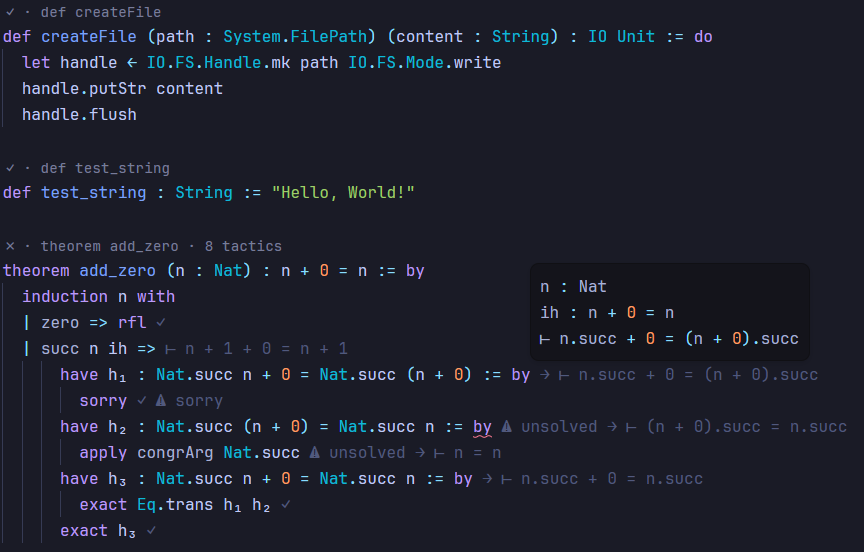

# 🪜 lean-to

Zed extension that adds Lean 4 support with a more native feel through LSP shenanigans.

Since the official Lean 4 language server was built with VSCode and its flexible extension API in mind, it doesn't fit well with Zed's more minimalistic approach.

So `lean-to` makes Zed appear more capable to the official Lean 4 language server than it really is. In turn, the server sends more advanced requests, which `lean-to` intercepts and then converts into simpler messages that Zed can actually support.



## How it works

`lean-to` has its own language server that is a proxy between Zed and the official Lean 4 language server. Standing in the middle allows us to intercept certain requests/responses framing them more idiomatically.

## Features

Each feature is on by default and individually toggleable:

1. Inline goal state `leanTo.inlayHints`
2. Code lenses above theorems `leanTo.codeLens`
3. Augmented semantic tokens `leanTo.semanticTokens`
4. Hover with goal state `leanTo.hover`
5. Elaboration progress bar `leanTo.progress`
6. Auto-restart on outdated imports `leanTo.autoRestart`

You can toggle these features in your Zed settings:

```json
{
  "lsp": {
    "lean_to_proxy": {
      "initialization_options": {
        "inlayHints": true,
        "codeLens": true,
        "semanticTokens": true,
        "hover": true,
        "progress": true,
        "autoRestart": true
      }
    }
  }
}
```

## Attribution

`find_lean4_lsp` in `src/lib.rs`, `snippets/lean.json` and tree-sitter queries in `languages\lean4` are derived from [owlx56/zed-lean4](https://github.com/owlx56/zed-lean4/), licensed under Apache-2.0. Modified for use in this project.
